# Multi-Website Platform - System Architecture v2.0

## Overview

This document describes the microservices architecture of the multi-website platform, a comprehensive SaaS solution for creating and managing multiple types of websites (e-commerce, booking, hotels, content sites, etc.).

## Architecture Diagram

```mermaid
graph TB
    subgraph "Client Layer"
        WEB[Web App<br/>Next.js]
        IOS[iOS App<br/>React Native]
        AND[Android App<br/>React Native]
        ADMIN[Admin Panel<br/>React]
    end

    subgraph "API Gateway Layer"
        GATEWAY[API Gateway<br/>Kong/NGINX<br/>Port 80/443]
        LB[Load Balancer<br/>Kubernetes Ingress]
    end

    subgraph "Core Services - Ports 8000-8003"
        AUTH[Auth Service<br/>Port 8000<br/>JWT, 2FA, OAuth, RBAC]
        USER[User Service<br/>Port 8001<br/>Profiles, Addresses, Verification]
        BILLING[Billing Service<br/>Port 8002<br/>Subscriptions, Payments, Invoices]
        NOTIF[Notification Service<br/>Port 8003<br/>Email, SMS, Push, In-App]
    end

    subgraph "Domain Services - Ports 8010-8020"
        SITE[Site Service<br/>Port 8010<br/>Multi-tenant, Domains]
        STORE[Storefront Service<br/>Port 8011<br/>Products, Orders, Cart]
        BOOK[Booking Service<br/>Port 8012<br/>Appointments, Calendar]
        HOTEL[Hotel Service<br/>Port 8017<br/>Rooms, Reservations]
        CONTENT[Content Service<br/>Port 8013<br/>Pages, Posts, Media]
        LEAD[Lead Service<br/>Port 8014<br/>Forms, CRM]
        WIDGET[Widget Service<br/>Port 8015<br/>Components, Layouts]
    end

    subgraph "Data Layer"
        PGCORE[(PostgreSQL<br/>Core DBs)]
        PGDOMAIN[(PostgreSQL<br/>Domain DBs)]
        REDIS[(Redis<br/>Cache)]
        S3[(AWS S3<br/>Storage)]
        ES[(Elasticsearch<br/>Search)]
    end

    subgraph "Infrastructure"
        TEMPORAL[Temporal<br/>Workflows]
        KAFKA[Apache Kafka<br/>Events]
        K8S[Kubernetes<br/>Orchestration]
        PROM[Prometheus<br/>Monitoring]
    end

    subgraph "External Services"
        STRIPE[Stripe]
        TWILIO[Twilio]
        FIREBASE[Firebase]
        OAUTH[OAuth Providers]
    end

    WEB --> GATEWAY
    IOS --> GATEWAY
    AND --> GATEWAY
    ADMIN --> LB

    GATEWAY --> AUTH
    GATEWAY --> USER
    GATEWAY --> BILLING
    GATEWAY --> NOTIF

    LB --> SITE
    LB --> STORE
    LB --> BOOK
    LB --> HOTEL
    LB --> CONTENT
    LB --> LEAD
    LB --> WIDGET

    AUTH --> PGCORE
    USER --> PGCORE
    BILLING --> PGCORE
    NOTIF --> PGCORE

    SITE --> PGDOMAIN
    STORE --> PGDOMAIN
    BOOK --> PGDOMAIN
    HOTEL --> PGDOMAIN
    CONTENT --> PGDOMAIN
    LEAD --> PGDOMAIN
    WIDGET --> PGDOMAIN

    AUTH --> REDIS
    USER --> REDIS
    USER --> S3
    STORE --> ES
    CONTENT --> ES

    BILLING --> STRIPE
    NOTIF --> TWILIO
    NOTIF --> FIREBASE
    AUTH --> OAUTH

    SITE --> TEMPORAL
    STORE --> KAFKA
    BOOK --> KAFKA
```



## System Components

### 1. Client Layer

| Component | Technology | Description |
|-----------|-----------|-------------|
| **Web Application** | Next.js 14 | Server-side rendered web application with SEO optimization |
| **Mobile Apps** | React Native | Cross-platform iOS and Android applications |
| **Admin Panel** | React + TypeScript | Administrative interface for platform management |

### 2. API Gateway Layer

| Component | Port | Description |
|-----------|------|-------------|
| **API Gateway** | 80/443 | Kong or NGINX - Request routing, authentication, rate limiting |
| **Load Balancer** | - | Kubernetes Ingress - Traffic distribution, SSL termination |

**Features:**
- Request routing and load balancing
- JWT token validation
- Rate limiting and throttling
- API versioning
- Request/response transformation
- SSL/TLS termination
- CORS handling

### 3. Core Services (Port 8000-8003)

#### 3.1 Auth Service (Port 8000) ✅ COMPLETED

**Responsibilities:**
- User authentication and authorization
- JWT token generation and validation
- Password management (hashing, reset, change)
- Two-factor authentication (TOTP)
- OAuth integration (Google, Facebook, GitHub)
- Role-based access control (RBAC)
- Session management
- Audit logging

**Database Tables:** 10 tables
- users, refresh_tokens, sessions, password_reset_tokens
- email_verification_tokens, oauth_accounts, login_attempts
- audit_logs, user_roles, role_permissions

**Tech Stack:**
- FastAPI, SQLAlchemy (async), PostgreSQL
- python-jose (JWT), passlib (bcrypt), pyotp (2FA)
- Redis (sessions, rate limiting)

#### 3.2 User Service (Port 8001) ✅ COMPLETED

**Responsibilities:**
- User profile management
- Multiple address management (shipping/billing)
- User preferences and settings
- Device registration for push notifications
- Activity tracking and logging
- Identity verification workflow
- Avatar and image upload (S3)

**Database Tables:** 6 tables
- user_profiles, user_addresses, user_preferences
- user_devices, user_activities, user_verifications

**Tech Stack:**
- FastAPI, SQLAlchemy (async), PostgreSQL
- Pillow (image processing), boto3 (S3)
- Redis (caching)

#### 3.3 Billing Service (Port 8002) 🚧 IN PROGRESS

**Responsibilities:**
- Subscription management
- Payment processing (Stripe integration)
- Invoice generation and management
- Billing history and analytics
- Webhook handling for payment events
- Refund processing
- Tax calculation

**Planned Database Tables:**
- subscriptions, payments, invoices
- billing_history, payment_methods, webhooks

**Tech Stack:**
- FastAPI, SQLAlchemy (async), PostgreSQL
- Stripe SDK, PDF generation

#### 3.4 Notification Service (Port 8003) ✅ COMPLETED

**Responsibilities:**
- Multi-channel notifications (Email, SMS, Push, In-App)
- Template management (Jinja2)
- User notification preferences
- Delivery tracking and analytics
- Retry logic for failed notifications
- Batch notification processing

**Database Tables:** 7 tables
- notifications, notification_templates, notification_preferences
- notification_batches, notification_events, notification_providers

**Tech Stack:**
- FastAPI, SQLAlchemy (async), PostgreSQL
- aiosmtplib (email), Twilio (SMS), Firebase (push)
- Jinja2 (templates), Celery (batch processing)

### 4. Domain Services (Port 8010-8020)

#### 4.1 Site Service (Port 8010) ✅ MVP COMPLETE

**Responsibilities:**
- Multi-tenant site management
- Custom domain configuration
- Theme and branding
- Site settings and configurations
- Site type determination

**Database Tables:** 4 tables
- sites, domains, themes, site_settings

#### 4.2 Storefront Service (Port 8011) ✅ MVP COMPLETE

**Responsibilities:**
- Product catalog management
- Inventory tracking
- Shopping cart
- Order processing
- Payment integration
- Shipping calculation

**Database Tables:** 7 tables
- products, categories, inventory, carts
- orders, order_items, shipping

**Planned Enhancement:**
- Grocery-specific features (weight-based pricing, delivery slots)

#### 4.3 Booking Service (Port 8012) ✅ MVP COMPLETE

**Responsibilities:**
- Service catalog management
- Availability calendar
- Appointment booking
- Staff scheduling
- Customer notifications
- Booking confirmations

**Database Tables:** 5 tables
- services, staff, bookings, availability, schedules

#### 4.4 Hotel Service (Port 8017) 📋 PLANNED

**Responsibilities:**
- Room management
- Reservations and bookings
- Check-in/check-out workflow
- Housekeeping management
- Room service
- Guest management

**Planned Database Tables:**
- rooms, room_types, reservations
- housekeeping, amenities, guests

#### 4.5 Content Service (Port 8013) ✅ MVP COMPLETE

**Responsibilities:**
- Page and post management
- Media library
- SEO optimization
- Content versioning
- Content scheduling

**Database Tables:** 3 tables
- pages, posts, media

#### 4.6 Lead Service (Port 8014) ✅ MVP COMPLETE

**Responsibilities:**
- Form builder
- Lead capture and management
- CRM integration
- Lead scoring
- Follow-up tracking

**Database Tables:** 2 tables
- forms, leads

#### 4.7 Widget Service (Port 8015) ✅ MVP COMPLETE

**Responsibilities:**
- Reusable widget management
- Component library
- Layout configurations
- Widget rendering

**Database Tables:** 1 table
- widgets

### 5. Data Layer

#### 5.1 PostgreSQL Databases

**Core Services Databases:**
- `auth_service_db` - Authentication data
- `user_service_db` - User profiles and preferences
- `billing_service_db` - Billing and subscription data
- `notification_service_db` - Notification records

**Domain Services Databases:**
- `site_service_db` - Site configurations
- `storefront_service_db` - Product and order data
- `booking_service_db` - Booking and appointment data
- `hotel_service_db` - Hotel and reservation data
- `content_service_db` - Content and media
- `lead_service_db` - Forms and leads
- `widget_service_db` - Widget configurations

**Why Separate Databases?**
- Data isolation and security
- Independent scaling
- Schema evolution independence
- Backup and recovery flexibility
- Microservice autonomy

#### 5.2 Redis

**Use Cases:**
- Session storage (Auth Service)
- Caching layer (User profiles, preferences)
- Rate limiting (API Gateway)
- Pub/Sub messaging
- Real-time features

**Configuration:**
- Multiple Redis instances for different use cases
- Persistence enabled for session data
- Clustering for high availability

#### 5.3 AWS S3

**Use Cases:**
- User avatars and profile images
- Verification documents
- Product images
- Media files (videos, documents)
- Static assets

**Features:**
- Automatic image optimization
- CDN integration (CloudFront)
- Versioning enabled
- Lifecycle policies

#### 5.4 Elasticsearch

**Use Cases:**
- Full-text search (products, content)
- Log aggregation and analysis
- Analytics and reporting
- Real-time search

### 6. Infrastructure Layer

#### 6.1 Temporal

**Use Cases:**
- Order processing workflows
- Booking confirmation workflows
- Saga patterns for distributed transactions
- Scheduled tasks
- Long-running processes

**Workflows:**
- Order fulfillment saga
- Subscription renewal
- Notification retry logic
- Data synchronization

#### 6.2 Apache Kafka

**Use Cases:**
- Event streaming
- Service-to-service communication
- Event sourcing
- Change data capture (CDC)

**Topics:**
- `user.events` - User lifecycle events
- `order.events` - Order processing events
- `booking.events` - Booking events
- `notification.events` - Notification events

#### 6.3 Kubernetes

**Features:**
- Container orchestration
- Horizontal Pod Autoscaling (HPA)
- Service discovery
- Rolling updates
- Health checks and self-healing

**Namespaces:**
- `core-services`
- `domain-services`
- `infrastructure`
- `monitoring`

#### 6.4 Prometheus + Grafana

**Metrics Collected:**
- Request rate, error rate, duration (RED metrics)
- CPU, memory, disk usage
- Database connection pool stats
- Cache hit/miss rates
- Custom business metrics

**Alerts:**
- High error rates
- Service downtime
- Database connection issues
- High latency

### 7. External Services

| Service | Purpose | Integration |
|---------|---------|-------------|
| **Stripe** | Payment processing | Billing Service |
| **Twilio** | SMS notifications | Notification Service |
| **SendGrid** | Email delivery | Notification Service |
| **Firebase** | Push notifications | Notification Service |
| **Google OAuth** | Social login | Auth Service |
| **Facebook OAuth** | Social login | Auth Service |
| **AWS Services** | Cloud infrastructure | Multiple services |

## Communication Patterns

### 1. Synchronous Communication (HTTP/REST)

- **Client → API Gateway → Services**
- Used for: CRUD operations, real-time requests
- Protocol: REST over HTTP/HTTPS
- Format: JSON

### 2. Asynchronous Communication (Events)

- **Service → Kafka → Service**
- Used for: Event-driven workflows, notifications
- Protocol: Kafka message queue
- Format: JSON events

### 3. Workflow Orchestration

- **Service → Temporal → Multiple Services**
- Used for: Complex business processes, sagas
- Protocol: Temporal workflows
- Format: Workflow definitions

## Data Flow Examples

### Example 1: User Registration

```
1. Client → API Gateway → Auth Service
   POST /api/v1/auth/signup

2. Auth Service:
   - Validate data
   - Hash password
   - Create user in auth_db
   - Generate email verification token

3. Auth Service → User Service
   POST /api/v1/profiles (create profile)

4. User Service:
   - Create user profile in user_db
   - Create default preferences

5. Auth Service → Notification Service
   POST /api/v1/notifications/send/email
   (Send welcome email)

6. Notification Service:
   - Render email template
   - Send via SMTP
   - Track delivery status

7. Response: User object + JWT tokens
```

### Example 2: Place Order

```
1. Client → API Gateway → Storefront Service
   POST /api/v1/orders

2. Storefront Service:
   - Validate cart items
   - Check inventory
   - Calculate total
   - Create order (PENDING status)

3. Storefront Service → Temporal
   Start order fulfillment workflow

4. Temporal Workflow:
   a. Call Billing Service
      - Process payment via Stripe
      - Create invoice

   b. If payment succeeds:
      - Update order status (CONFIRMED)
      - Reserve inventory
      - Call Notification Service
        (Send order confirmation email)

   c. If payment fails:
      - Update order status (FAILED)
      - Rollback inventory
      - Send failure notification

5. Publish event: order.created

6. Response: Order object with status
```

### Example 3: Upload Avatar

```
1. Client → API Gateway → User Service
   POST /api/v1/profiles/{user_id}/avatar
   (Multipart form data with image)

2. User Service:
   - Validate file type and size
   - Process image with Pillow
     (Resize to 1000x1000, optimize)

3. User Service → AWS S3
   - Upload optimized image
   - Get public URL

4. User Service:
   - Update user profile with avatar_url
   - Log activity

5. User Service → Notification Service
   (Optional: Notify user of profile update)

6. Response: Avatar URL
```

## Security Architecture

### 1. Authentication & Authorization

- **JWT Tokens**: Stateless authentication
- **Refresh Tokens**: Long-lived tokens for token renewal
- **2FA**: TOTP-based two-factor authentication
- **OAuth**: Social login integration
- **RBAC**: Role-based access control

### 2. Network Security

- **API Gateway**: Entry point with SSL/TLS termination
- **Service Mesh**: Istio for service-to-service encryption
- **Private Subnets**: Services not directly accessible
- **Security Groups**: Firewall rules at instance level

### 3. Data Security

- **Encryption at Rest**: PostgreSQL encryption
- **Encryption in Transit**: TLS for all connections
- **Password Hashing**: bcrypt with 12 rounds
- **Secrets Management**: Kubernetes secrets / AWS Secrets Manager
- **PII Protection**: GDPR compliance, data anonymization

### 4. Rate Limiting

- **API Gateway Level**: 100 requests/minute per IP
- **Service Level**: Custom rate limits per endpoint
- **User Level**: Different limits for authenticated users

## Scalability Strategy

### 1. Horizontal Scaling

- **Kubernetes HPA**: Auto-scale based on CPU/memory
- **Database Read Replicas**: Scale read operations
- **Redis Cluster**: Distributed caching
- **CDN**: CloudFront for static assets

### 2. Caching Strategy

- **L1 Cache**: In-memory application cache
- **L2 Cache**: Redis distributed cache
- **CDN Cache**: CloudFront edge caching
- **Database Query Cache**: PostgreSQL query caching

### 3. Load Balancing

- **Application Load Balancer**: Layer 7 load balancing
- **Service Load Balancing**: Kubernetes service discovery
- **Database Connection Pooling**: SQLAlchemy pooling (10 connections)

## Monitoring & Observability

### 1. Logs

- **Structured Logging**: JSON format
- **Log Aggregation**: ELK Stack (Elasticsearch, Logstash, Kibana)
- **Log Levels**: DEBUG, INFO, WARNING, ERROR, CRITICAL

### 2. Metrics

- **Application Metrics**: Custom business metrics
- **Infrastructure Metrics**: CPU, memory, disk, network
- **Database Metrics**: Connections, queries, latency
- **Cache Metrics**: Hit rate, evictions

### 3. Tracing

- **Distributed Tracing**: Jaeger / Zipkin
- **Request Correlation**: Trace ID propagation
- **Performance Profiling**: Identify bottlenecks

### 4. Alerts

- **Service Health**: Uptime, response time
- **Error Rates**: 4xx, 5xx errors
- **Resource Usage**: CPU, memory thresholds
- **Business Metrics**: Order failures, payment issues

## Disaster Recovery

### 1. Backup Strategy

- **Database Backups**: Daily full backups, hourly incremental
- **S3 Versioning**: File version history
- **Configuration Backups**: Infrastructure as Code

### 2. Recovery Plan

- **RTO**: Recovery Time Objective - 1 hour
- **RPO**: Recovery Point Objective - 15 minutes
- **Failover**: Automated failover for critical services
- **Multi-Region**: Disaster recovery in separate AWS region

## Deployment Strategy

### 1. CI/CD Pipeline

```
1. Code Commit (GitHub)
   ↓
2. Build & Test (GitHub Actions)
   ↓
3. Build Docker Image
   ↓
4. Push to Container Registry
   ↓
5. Deploy to Kubernetes
   - Staging environment (auto)
   - Production (manual approval)
   ↓
6. Health Checks
   ↓
7. Smoke Tests
```

### 2. Deployment Patterns

- **Blue-Green Deployment**: Zero-downtime deployments
- **Canary Releases**: Gradual rollout to subset of users
- **Rolling Updates**: Progressive pod replacement
- **Rollback**: Automated rollback on failure

## Performance Optimization

### 1. Database Optimization

- **Indexes**: Strategic indexing on frequently queried columns
- **Query Optimization**: Explain analyze for slow queries
- **Connection Pooling**: Reuse database connections
- **Read Replicas**: Offload read traffic

### 2. API Optimization

- **Response Caching**: Cache frequently accessed data
- **Compression**: Gzip compression for responses
- **Pagination**: Limit result sets
- **Field Selection**: GraphQL-style field selection

### 3. Image Optimization

- **Automatic Resizing**: Pillow image processing
- **WebP Format**: Modern image format support
- **Lazy Loading**: Load images on demand
- **CDN Delivery**: CloudFront edge caching

## Cost Optimization

### 1. Infrastructure Costs

- **Right-sizing**: Match instance sizes to workload
- **Auto-scaling**: Scale down during low traffic
- **Spot Instances**: Use for non-critical workloads
- **Reserved Instances**: Long-term cost savings

### 2. Data Transfer Costs

- **CDN**: Reduce origin requests
- **Compression**: Reduce bandwidth usage
- **Regional Deployment**: Keep data close to users

## Future Enhancements

### Version 2.5 (Next 3-6 months)

- [ ] Analytics site type and service
- [ ] AI/ML features (recommendations, chatbots)
- [ ] Multi-currency support
- [ ] Multi-language (i18n)
- [ ] Advanced integrations (Shopify, WooCommerce)

### Version 3.0 (Next 6-12 months)

- [ ] White-label platform
- [ ] Multi-organization support
- [ ] API marketplace
- [ ] Plugin system
- [ ] 10+ total site types
- [ ] Advanced analytics dashboard

## Technology Stack Summary

| Layer | Technologies |
|-------|-------------|
| **Frontend** | Next.js, React, React Native, TypeScript |
| **Backend** | FastAPI, Python 3.11+ |
| **Databases** | PostgreSQL 15, Redis 7 |
| **Message Queue** | Apache Kafka, Temporal |
| **Storage** | AWS S3, CloudFront |
| **Search** | Elasticsearch |
| **Orchestration** | Kubernetes, Docker |
| **Monitoring** | Prometheus, Grafana, ELK Stack |
| **CI/CD** | GitHub Actions, ArgoCD |
| **Cloud** | AWS (primary) |

## Port Allocation

| Service | Port | Status |
|---------|------|--------|
| API Gateway | 80/443 | Production |
| Auth Service | 8000 | ✅ Completed |
| User Service | 8001 | ✅ Completed |
| Billing Service | 8002 | 🚧 In Progress |
| Notification Service | 8003 | ✅ Completed |
| Site Service | 8010 | ✅ MVP Complete |
| Storefront Service | 8011 | ✅ MVP Complete |
| Booking Service | 8012 | ✅ MVP Complete |
| Content Service | 8013 | ✅ MVP Complete |
| Lead Service | 8014 | ✅ MVP Complete |
| Widget Service | 8015 | ✅ MVP Complete |
| Hotel Service | 8017 | 📋 Planned |

## Conclusion

This microservices architecture provides:

✅ **Scalability** - Independent scaling of services
✅ **Reliability** - Fault isolation and redundancy
✅ **Maintainability** - Clear service boundaries
✅ **Flexibility** - Technology diversity per service
✅ **Performance** - Optimized data access patterns
✅ **Security** - Defense in depth

The platform is designed to support multiple website types while maintaining high performance, reliability, and developer productivity.
